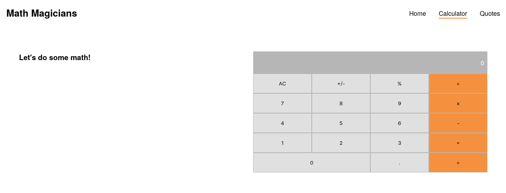

# Math magicians

"Math magicians" is a website for all fans of mathematics. It is a Single Page App (SPA) that allows users to:

- Make simple calculations.
- Read a random math-related quote.

## Built With

- HTML
- CSS
- JavaScript
- React

## Getting Started

Clone project, run in your terminal:

`$ git clone https://github.com/rachidelaid/math-magicians`

Open the cloned project in your code editor and run:

`$ cd math-magicians`

Install npm packages, run:

`$ npm install`

Then run the server:

`$ npm start`

## Authors

👤 **Rachid El aid**

- GitHub: [@rachidelaid](https://github.com/rachidelaid)
- Twitter: [@rachidelaid1](https://twitter.com/rachidelaid1)
- LinkedIn: [rachid elaid](https://www.linkedin.com/in/rachid-elaid-106336203/)

## Show your support

Give a ⭐️ if you like this project!

Feel free to check the [issues page](../../issues/).

## 📝 License

This project is [MIT](./MIT.md) licensed.
